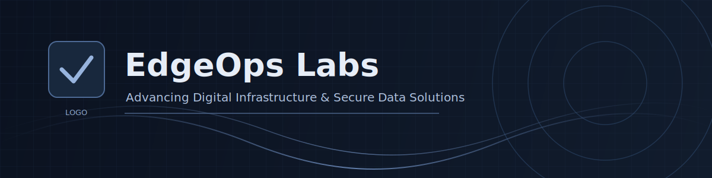

# EdgeOps Labs

	<strong>Advancing Digital Infrastructure &amp; Secure Data Solutions.</strong>

	
	
	
	

	
	
	
	

---

## Mission

**EdgeOps Labs** delivers secure, smart, and scalable data solutions for defense, government, and maritime operations.
Our focus spans **data integration**, **advanced analytics**, and **edge-optimized AI/ML** that perform in constrained and mission-critical environments.

---

## Core Expertise

| Domain | Capability |
|---|---|
| 🛡️ Security | Zero-trust aligned architectures, resilient data pipelines, and hardened deployment patterns |
| 🔗 Data Integration | Cross-domain ingestion, interoperability frameworks, and real-time data orchestration |
| 📊 Analytics | Operational intelligence, decision-grade dashboards, and performance telemetry |
| 🤖 Edge AI/ML | Low-latency inference, model optimization at the edge, and offline-capable autonomy |
| ⚓ Maritime Systems | Vessel, port, and maritime-domain awareness solutions for complex operational theaters |
| 🏛️ Public Sector Delivery | Mission-focused engineering with compliance-ready and scalable implementation models |

---

## The Edge Advantage

Traditional DevOps optimizes software delivery.
**EdgeOps** extends that mindset to distributed, high-stakes environments where compute, connectivity, and autonomy must converge.

At EdgeOps Labs, this means engineering systems that are:

- **Operationally autonomous** in industrial and commercial edge contexts
- **Secure by design** across data lifecycle and infrastructure layers
- **Scalable by architecture** from cloud core to tactical edge

---

## Featured Repositories

| Repository | Stack | Focus |
|---|---|---|
| [Website](https://github.com/EdgeOpslabs/website) | TypeScript | Organization website, technical storytelling, and platform presence |
| [Blogs](https://github.com/EdgeOpslabs/blogs) | TypeScript | Engineering insights, field lessons, and thought leadership |
| [Nexus](https://github.com/EdgeOpslabs/nexus) | Go | High-performance backend services and edge-ready integration core |

---

## Organization Activity

	

---

## Join the Mission

If you are building secure digital infrastructure for defense, government, or maritime systems, we welcome collaboration.

- **Contributors:** Explore our repositories and open issues to get involved.
- **Partners:** Reach out for strategic delivery, product integration, and mission-aligned innovation.
- **Follow on LinkedIn:** [EdgeOps Labs](https://www.linkedin.com/company/edgeops-labs)
- **Join Discord Community:** [discord.gg/spXsHKvZ7P](https://discord.gg/spXsHKvZ7P)
- **Contact:** [edgeopslabs.community@gmail.com](mailto:edgeopslabs.community@gmail.com)

---

	<em>EdgeOps Labs | Secure Data. Intelligent Systems. Mission-Ready Outcomes.</em>

